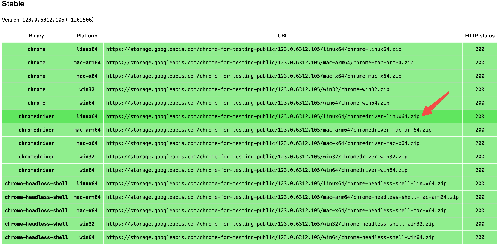

# Browser Driver

运行selenium需要用到浏览器驱动，本章介绍浏览器的驱动下载。<br>
- [Browser Driver](#browser-driver)
  - [Drivers 简介:](#drivers-简介)
  - [常见浏览器驱动程序的下载链接:](#常见浏览器驱动程序的下载链接)
  - [Chrome Driver下载:](#chrome-driver下载)
  - [下载、安装指令:](#下载安装指令)
  - [ubuntu安装chrome:](#ubuntu安装chrome)
  - [ubuntu更新Chrome指令(可选)：](#ubuntu更新chrome指令可选)

## Drivers 简介:

Selenium requires a driver to interface with the chosen browser.<br>

Selenium需要一个驱动程序来与所选的浏览器进行交互。<br>

Firefox, for example, requires `geckodriver`, which needs to be installed before the below examples can be run.<br>

例如，Firefox需要 `geckodriver` ，必须在下面的示例运行之前安装。<br>

Make sure it’s in your PATH, e. g., place it in `/usr/bin` or `/usr/local/bin` .<br>

确保它在你的PATH中，例如，将它放在 `/usr/bin` 或 `/usr/local/bin` 中。<br>

```python
from selenium import webdriver
from selenium.webdriver.common.by import By
from selenium.webdriver.common.keys import Keys

# 打开一个新的Firefox浏览器
browser = webdriver.Firefox()
# 加载Yahoo首页
browser.get('http://www.yahoo.com')
assert 'Yahoo' in browser.title

elem = browser.find_element(By.NAME, 'p')  # Find the search box
# 搜索“seleniumhq”
elem.send_keys('seleniumhq' + Keys.RETURN)
# 关闭浏览器
browser.quit()
```

Failure to observe this step will give you an error(如果未遵守这一步骤，将会出现错误) `selenium.common.exceptions.WebDriverException`:<br>

```log
Message: ‘geckodriver’ executable needs to be in PATH.('geckodriver'可执行文件需要在PATH中)
```

## 常见浏览器驱动程序的下载链接:

Other supported browsers will have their own drivers available.<br>

其他支持的浏览器将拥有自己的驱动程序可用。<br>

Links to some of the more popular browser drivers follow.<br>

以下是一些更受欢迎的浏览器驱动程序的链接。<br>

| 浏览器  | 下载链接                                           |
|---------|----------------------------------------------------|
| Chrome  | [https://chromedriver.chromium.org/downloads](https://chromedriver.chromium.org/downloads) |
| Edge    | [https://developer.microsoft.com/en-us/microsoft-edge/tools/webdriver/](https://developer.microsoft.com/en-us/microsoft-edge/tools/webdriver/) |
| Firefox | [https://github.com/mozilla/geckodriver/releases](https://github.com/mozilla/geckodriver/releases) |
| Safari  | [https://webkit.org/blog/6900/webdriver-support-in-safari-10/](https://webkit.org/blog/6900/webdriver-support-in-safari-10/) |


## Chrome Driver下载:


🏖️图中内容解释:<br>

Current Releases(当前版本):<br>

If you are using Chrome version 115 or newer, please consult the Chrome for Testing availability dashboard.<br>

```log
https://googlechromelabs.github.io/chrome-for-testing/
```

如果您正在使用 Chrome 版本 115 或更新版本，请查看 Chrome 测试可用性仪表板。<br>

This page provides convenient JSON endpoints for specific ChromeDriver version downloading.<br>

该页面提供了特定 ChromeDriver 版本下载的便捷 JSON 终端点。<br>

For older versions of Chrome, please see below for the version of ChromeDriver that supports it.<br>

对于较旧版本的 Chrome，请参阅下文支持其的 ChromeDriver 版本。<br>

For more information on selecting the right version of ChromeDriver, please see the Version Selection page.<br>

有关选择正确版本的 ChromeDriver 的更多信息，请参阅版本选择页面。<br>




## 下载、安装指令:

`wget` 下载可能会由于网络原因下载失败，如果失败可以在其他能够下载的主机上下载，然后将文件上传到服务器。<br>

```bash
# 下载ChromeDriver
wget https://storage.googleapis.com/chrome-for-testing-public/123.0.6312.105/linux64/chromedriver-linux64.zip

# 解压ChromeDriver
unzip chromedriver-linux64.zip

# 移动到/usr/local/bin目录
sudo mv chromedriver-linux64 /usr/local/bin/

# 清理压缩包
rm chromedriver-linux64.zip
```

终端显示:<br>

```log
(base) root@iZ2zea5v77oawjy2qzxxxxx:/data/selenium_data# wget https://storage.googleapis.com/chrome-for-testing-public/123.0.6312.105/linux64/chromedriver-linux64.zip
--2024-04-10 18:03:39--  https://storage.googleapis.com/chrome-for-testing-public/123.0.6312.105/linux64/chromedriver-linux64.zip
Resolving storage.googleapis.com (storage.googleapis.com)... 142.251.42.251, 172.217.163.59, 172.217.160.91, ...
Connecting to storage.googleapis.com (storage.googleapis.com)|142.251.42.251|:443... connected.
HTTP request sent, awaiting response... 200 OK
Length: 8636471 (8.2M) [application/zip]
Saving to: ‘chromedriver-linux64.zip’

chromedriver-linux64.zip             100%[=====================================================================>]   8.24M  15.5MB/s    in 0.5s    

2024-04-10 18:03:40 (15.5 MB/s) - ‘chromedriver-linux64.zip’ saved [8636471/8636471]

(base) root@iZ2zea5v77oawjy2qzxxxxx:/data/selenium_data# unzip chromedriver-linux64.zip
Archive:  chromedriver-linux64.zip
  inflating: chromedriver-linux64/LICENSE.chromedriver  
  inflating: chromedriver-linux64/chromedriver  
(base) root@iZ2zea5v77oawjy2qzxxxxx:/data/selenium_data# sudo mv chromedriver-linux64 /usr/local/bin/
(base) root@iZ2zea5v77oawjy2qzxxxxx:/data/selenium_data# 
```


## ubuntu安装chrome:

1. **下载 Google 的公钥**：

```bash
wget -q -O - https://dl.google.com/linux/linux_signing_key.pub | sudo apt-key add -
```

2. **设置 Google Chrome 的仓库**：

```bash
sudo sh -c 'echo "deb [arch=amd64] http://dl.google.com/linux/chrome/deb/ stable main" >> /etc/apt/sources.list.d/google-chrome.list'
```

3. **更新软件包列表**：

```bash
sudo apt-get update
```

4. **安装 Google Chrome**：

如果之前没有安装过 Google Chrome，使用：<br>

```bash
sudo apt-get install google-chrome-stable
```

安装后出现下列信息是正常的:<br>

```log
Running kernel seems to be up-to-date.

No services need to be restarted.

No containers need to be restarted.

No user sessions are running outdated binaries.

No VM guests are running outdated hypervisor (qemu) binaries on this host.
```

这段日志信息主要记录了在 Ubuntu 系统上安装软件包时的步骤和相关的系统配置更新。大部分内容都是正常的，包括设置新软件包、处理系统触发器（如 `libc-bin` 和 `libglib2.0-0`）、以及配置 `google-chrome-stable` 等。<br>

一个值得注意的地方是这两行关于 `debconf` 的警告：<br>

```log
debconf: unable to initialize frontend: Dialog
debconf: (Dialog frontend requires a screen at least 13 lines tall and 31 columns wide.)
debconf: falling back to frontend: Readline
```

这意味着 `debconf`（Debian 配置管理工具）尝试使用一个对话框界面来显示配置信息，但是因为当前环境可能是一个不支持图形界面的终端或屏幕尺寸不足，所以无法正确初始化对话框界面。因此，系统自动回退到使用更基础的 `Readline` 界面。这在没有 GUI 的服务器环境中是常见的，并不影响软件包的安装和系统的功能。<br>

总的来说，除了上述的 `debconf` 警告之外，其他的日志信息显示软件包安装过程正常，没有错误报告。<br>


## ubuntu更新Chrome指令(可选)：

笔者使用的 ubuntu 18.4, 当前的 Google Chrome 版本是 121.0.6167.85。要升级 Google Chrome 到最新版本:<br>

1. 首先，更新包索引：

```bash
sudo apt-get update
```

2. 然后，安装最新版本的 Google Chrome：

```bash
sudo apt-get --only-upgrade install google-chrome-stable
```

3. 最后，您可以再次检查 Chrome 的版本来确认升级：

```
google-chrome --version
```

更新后显示:<br>

```txt
(base) root@iZ2zea5v77oawjy2qz7xxxx:/data/selenium_data# google-chrome --version
Google Chrome 123.0.6312.105
```
