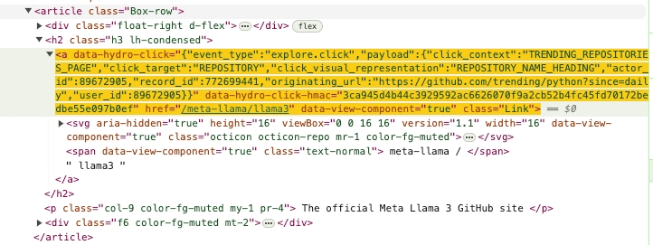

# CSS选择器

CSS选择器是一种在HTML和XML文档中通过CSS（层叠样式表）选择和定位元素的模式或规则。在Selenium自动化测试中，CSS选择器被广泛使用来查找需要交互的网页元素。<br>

参考链接:<br>

```log
https://www.w3cschool.cn/css/css-selector.html
```

- [CSS选择器](#css选择器)
  - [CSS选择器类型与用法示例:](#css选择器类型与用法示例)
  - [相邻选择器:](#相邻选择器)
    - [语法:](#语法)
    - [示例:](#示例)
  - [子选择器:](#子选择器)
    - [语法](#语法-1)
    - [示例:](#示例-1)
    - [拓展:](#拓展)
      - [注意事项:](#注意事项)
      - [选择器分析:](#选择器分析)
      - [示例:](#示例-2)
  - [后代选择器:](#后代选择器)
    - [语法](#语法-2)
    - [示例](#示例-3)
  - [子选择器和后代选择器的区别:](#子选择器和后代选择器的区别)
    - [子选择器（Child Selector）:](#子选择器child-selector)
    - [后代选择器（Descendant Selector）:](#后代选择器descendant-selector)
    - [应用场景比较](#应用场景比较)
  - [CSS选择器OR语句:](#css选择器or语句)
  - [复杂CSS选择器示例:](#复杂css选择器示例)
    - [标签结合类名:](#标签结合类名)


## CSS选择器类型与用法示例:

| 选择器       | 用法示例               | 用法示例说明                                       |
| ----------- | --------------------- | ---------------------------------------------- |
| id选择器     | #myid                 | 选择 id 为"myid"的元素。                        |
| 类选择器     | .myclassname           | 选择所有 class 为"myclassname"的元素。          |
| 标签选择器    | div,h1,p              | `div, h1, p` 表示"或"(OR)，而不是"与"(AND)。该选择器会匹配任何为`div`、`h1`或`p`的元素。       |
| 相邻选择器    | h2+p                  | 选择所有紧跟在 `<h2>` 元素之后的 `<p>` 元素。   |
| 子选择器      | ul > li               | 选择所有 `<ul>` 元素的直接子元素 `<li>`。        |
| 后代选择器    | li a                  | 选择所有 `<li>` 元素的后代 `<a>` 元素。         |
| 通配符选择器  | *                     | 选择所有元素。                                 |
| 属性选择器    | a[rel="external"]     | 选择所有带有 `rel="external"` 属性的 `<a>` 元素。 |
| 伪类选择器    | a:hover, li:nth-child | 当 `<a>` 元素鼠标悬停时选择，以及选择父元素中的第 n 个 `<li>` 子元素。 |

上表从上到下亦表示CSS选择器的匹配效率。<br>


## 相邻选择器:

CSS中的相邻选择器是一种组合选择器，用于选择紧随其后的特定元素。它由两个选择器组成，它们之间由加号（+）连接。具体来说，第一个选择器后面紧跟着的第二个选择器所指定的元素，会被选中。<br>

这种选择器非常有用，例如在处理HTML结构中相邻的元素时，比如段落或列表项等。<br>

### 语法:

```css
选择器1 + 选择器2 {
    /* 样式规则 */
}
```

这里，“选择器1”后面紧跟着的“选择器2”所指定的元素将应用样式规则。<br>

### 示例:

假设你有以下HTML结构：<br>

```html
<h2>标题</h2>
<p>这是第一个段落。</p>
<p>这是第二个段落，它将采用特定的样式。</p>
```

🔥🔥🔥如果你想只为 **紧跟** 在`<h2>`标签后的第一个`<p>`标签设置样式，你可以使用以下CSS：<br>

```css
h2 + p {
    color: red;
}
```

这段CSS会将紧随`<h2>`标签后的第一个`<p>`标签的文本颜色设置为红色。注意，它不会影响后面的其他`<p>`标签，即使它们也是`<h2>`标签后的兄弟元素。<br>

相邻选择器只影响紧接着第一个选择器后的第二个选择器指定的元素，这一点是需要特别注意的。它是选择特定兄弟元素中非常有用的工具。<br>


## 子选择器:

CSS中的子选择器（也称为子代选择器）是一种用于 **选择特定父元素的直接子元素** 的选择器。子选择器通过使用大于号（`>`）来指定，这个符号放在两个选择器之间，表示只选择直接位于指定父元素下的子元素。<br>

### 语法

```css
父选择器 > 子选择器 {
    /* 样式规则 */
}
```

这里，只有直接为“父选择器”的子元素才会被应用“子选择器”指定的样式。<br>

### 示例:

假设你的HTML结构如下：<br>

```html
<div>
    <p>这是一个直接的子元素。</p>
    <div>
        <p>这是一个非直接的子元素。</p>
    </div>
</div>
```

如果你想只为`<div>`的直接子元素`<p>`设置样式，可以使用以下CSS：<br>

```css
div > p {
    color: blue;
}
```

这段CSS会将直接位于`<div>`内部的`<p>`标签的文本颜色设置为蓝色。注意，嵌套在内部`<div>`中的`<p>`标签不会被选中，因为它不是最外层`<div>`的直接子元素。<br>

子选择器非常有用于当你需要精确控制哪些元素应该应用样式，而不希望样式影响到嵌套更深层的相同元素时。它提供了一种方式来精确选择和样式化元素的层次结构。<br>

### 拓展:

对于上述HTML结构，如果你想选择 `<p>这是一个非直接的子元素。</p>`，可以使用以下CSS:<br>

```css
div > div > p {
    color: blue;
}
```

#### 注意事项:

使用 `div > div > p` 作为选择器确实是一种更精确的方式来选择特定的元素，尤其是当你想限制样式仅应用于特定层级结构的直接子代时。这种选择器确保只有直接层级关系的元素被选中，避免了其他可能的嵌套结构干扰。<br>

#### 选择器分析:

- `div > div > p`: 这个选择器意味着只有那些直接嵌套在一个`div`内的另一个`div`里的`p`元素才会被选中。这提供了对HTML结构的严格控制，确保不会误选任何不符合这一层级结构的`p`元素。<br>

#### 示例:

假设你的HTML结构如下：<br>

```html
<div>
    <p>这是一个直接的子元素。</p>
    <div>
        <p>这是一个非直接的子元素。</p>
    </div>
    <section>
        <div>
            <p>这是另一个非直接的子元素。</p>
        </div>
    </section>
</div>
```

对于上述结构，使用选择器`div > div > p`将只会选中：<br>

```html
<p>这是一个非直接的子元素。</p>
```

并且不会选中位于`section > div > p`中的`p`元素，因为其不符合直接的`div > div > p`结构。<br>

这种选择器非常适用于你有明确的结构约束并希望确保样式只应用于特定层次的元素时。通过这种方式，你可以避免样式泄漏到其他可能的嵌套元素中，从而保持CSS的清晰和有效管理。<br>


## 后代选择器:

CSS中的后代选择器是一种非常基本且常用的选择器，用于选择某个特定元素内部的 **所有后代元素**（不仅仅是直接子元素）。后代选择器通过简单地将两个或多个选择器用空格分开来表示。<br>

### 语法

```css
祖先选择器 后代选择器 {
    /* 样式规则 */
}
```

在这里，“祖先选择器”是更外层的元素，而“后代选择器”是内部的元素。所有位于“祖先选择器”内部的“后代选择器”指定的元素都会被选中，无论它们在层次结构中的深度如何。<br>

### 示例

假设你的HTML结构如下：<br>

```html
<div>
    <p>这是一个直接的后代。</p>
    <section>
        <p>这是一个间接的后代。</p>
    </section>
</div>
```

如果你想为所有位于`<div>`元素内部的`<p>`元素设置样式，无论它们的嵌套深度如何，可以使用以下CSS：<br>

```css
div p {
    color: green;
}
```

这段CSS将为所有在`<div>`内部的`<p>`元素设置文本颜色为绿色，包括直接子元素和任何更深层次的子元素。<br>

后代选择器非常有用，因为它允许你广泛地应用样式到所有相应的后代元素，而无需关心它们具体的嵌套结构。这使得后代选择器成为编写高效和灵活的CSS代码的重要工具。<br>


## 子选择器和后代选择器的区别:

子选择器和后代选择器在CSS中都用于指定元素的层次关系，但它们的选择范围和使用场景有明显的区别。下面是这两种选择器的主要区别：<br>

### 子选择器（Child Selector）:

- **语法**：`父选择器 > 子选择器`

- **功能**：只选择作为指定元素直接子元素的元素。

- **限制**：仅限于直接的一级子元素，不会选择更深层次的后代元素。

- **示例**：`div > p` 将仅选择`<div>`元素直接包含的`<p>`元素，而不包括更深层嵌套的`<p>`元素。

### 后代选择器（Descendant Selector）:

- **语法**：`祖先选择器 后代选择器`

- **功能**：选择位于指定元素内部的所有后代元素，无论它们的嵌套深度如何。

- **范围**：包括所有层次的后代元素，不仅仅是直接子元素。

- **示例**：`div p` 将选择所有在`<div>`元素内部的`<p>`元素，无论它们是直接还是间接子元素。

### 应用场景比较

- **子选择器** 更适用于你需要精确控制只对直接子元素应用样式的情况。例如，当你有一个复杂的布局，但只希望更改顶级子元素的样式时。

- **后代选择器** 适用于你想一并设置一个元素及其所有子元素的样式，这对于确保元素整体的样式一致性非常有帮助。

简而言之，子选择器提供了更严格、更精确的控制，而后代选择器提供了更广泛的选择范围，使其适合于更通用的样式应用。选择使用哪一种选择器取决于你的具体需求和所处理的HTML结构的复杂度。<br>


## CSS选择器OR语句:

```css
'.result-op.c-container[tpl="news-realtime"], .result.c-container[tpl="se_com_default"]'
```

以英文逗号(`,`)的方式将多个CSS选择器联合，CSS选择器之间的关系是OR。<br>


## 复杂CSS选择器示例:

本节结合HTML示范各种情况下CSS选择器写法。<br>

### 标签结合类名:



如果你想要检索到 `href` 属性，可以使用下列CSS选择器:<br>

子选择器:<br>

```log
article.Box-row > h2 > a[href]
```

后代选择器:<br>

```log
article.Box-row h2 a[href]
```

标签、类名混合使用:<br>

```log
article.Box-row .h3.lh-condensed a[href]
```

如果class具有唯一性，可以使用简化的写法:<br>

```log
article.Box-row .h3 a[href]
```

🚨🚨🚨注意: 不能忘记空格，混合写成 `article.Box-row.h3` 的写法是错误的。因为它指定了寻找具有 `Box-row` 和 `h3` 两个类同时存在于同一个 `article` 元素上的情况，实际上这种情况并不存在，`.h3` 是 `article.Box-row` 的子元素。<br>